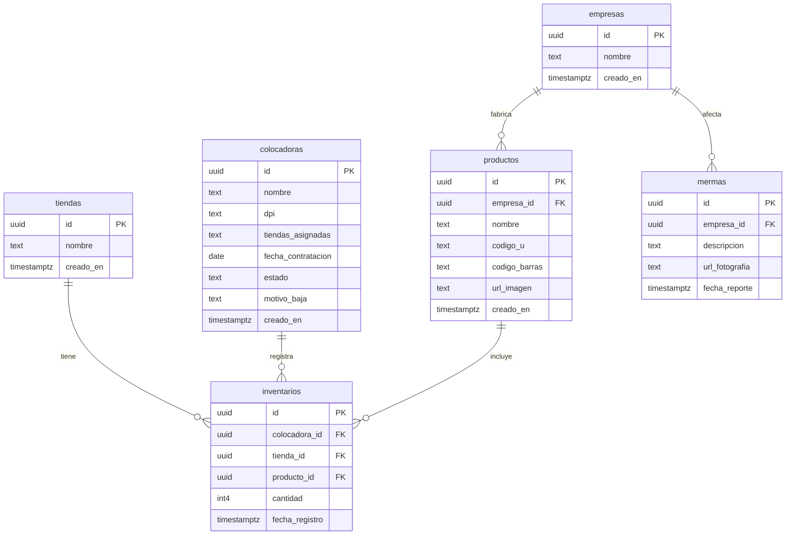

# Comercializadora Los Altos — Sistema Web de Control de Inventarios y Colocación

[](https://nextjs.org/)
[](https://react.dev/)
[](https://www.typescriptlang.org/)
[](https://tailwindcss.com/)
[](https://supabase.com/)
[](https://www.docker.com/)

Plataforma web integral diseñada para la optimización del control de inventarios físicos, supervisión de colocadoras en campo, reporte de mermas con evidencia fotográfica y generación de reportes analíticos para supermercados independientes y empresas proveedoras en Guatemala.

---

## 📋 Tabla de Contenidos
- [Características Principales](#-características-principales)
- [Módulos y Roles](#-módulos-y-roles)
- [Arquitectura de Base de Datos (Supabase)](#-arquitectura-de-base-de-datos-supabase)
- [Credenciales de Demostración](#-credenciales-de-demostración)
- [Requisitos Previos](#-requisitos-previos)
- [Instalación y Ejecución Local](#-instalación-y-ejecución-local)
- [Despliegue en Producción](#-despliegue-en-producción)
- [Estructura del Proyecto](#-estructura-del-proyecto)
- [Licencia](#-licencia)

---

## ✨ Características Principales

- **Gestión Multi-Rol con RBAC**: Control de acceso basado en roles para Administradores, Colocadoras de campo y Empresas proveedoras de productos.
- **Toma de Inventarios Móvil**: Interfaz optimizada para teléfonos celulares en campo con validación estricta de entradas numéricas enteras (sin caracteres inválidos ni secuencias `00`).
- **Control Fotográfico de Mermas**: Registro de productos dañados con fotografía, supermercado, empresa y motivo para reclamos de garantía y créditos.
- **Alertas de Vencimiento de Lotes**: Clasificación visual automática de productos en estado *Vigente*, *Por Vencer (< 30 días)* y *Vencido*.
- **Portal de Proveedores con Aislamiento**: Cada marca (ej. Irex, Tío Nacho) visualiza únicamente sus existencias, rotación de producto (Alta, Media, Baja) y puede descargar reportes en formato CSV.
- **Base de Datos en Supabase / PostgreSQL**: Conexión nativa en la nube mediante API y persistencia en tiempo real.

---

## 👥 Módulos y Roles

### 1. 🛡️ Módulo de Administración (`/admin`)
- **Dashboard Global**: Estadísticas de tiendas activas, marcas proveedoras, catálogo total de productos y colocadoras registradas.
- **Gestión de Colocadoras**: Contratación formal con registro de DPI numérico, fecha de ingreso, asignación de tiendas y bajas con motivo auditado.
- **Gestión de Tiendas y Supermercados**: Administración de puntos de venta (Gran Gallo, Más y Más, Espiga de Oro, La Estrella Malacatán).
- **Catálogo Maestro de Productos**: Registro de Código U interno, Código de barras (EAN), fotografía y empresa fabricante.
- **Mermas, Vencimientos y Sugeridos**: Supervisión y generación de órdenes de compra sugeridas para reposición de góndola.

### 2. 🏪 Módulo de Colocadora de Campo (`/colocadora`)
- Selector de tienda asignada por turno.
- **Toma de Inventario**: Conteo físico por góndola y pasillo.
- **Reporte de Producto en Mal Estado**: Subida de fotografía del daño y descripción detallada.
- **Registro de Vencimientos**: Fecha de caducidad por lote y cantidad encontrada.
- **Historial de Actividad**: Registro cronológico de actividades completadas.

### 3. 🏢 Módulo de Empresa Proveedora (`/empresa`)
- Aislamiento estricto de datos de acuerdo a la empresa autenticada.
- **Existencias por Tienda**: Stock consolidado por supermercado.
- **Análisis de Rotación de Inventario**: Clasificación de movimiento en góndola (Alta rotación > 30 uds, Media 15-30 uds, Baja < 15 uds).
- **Reporte de Mermas y Vencimientos**: Historial de averías y productos próximos a caducar.
- **Exportación a CSV**: Descarga directa de archivos de cálculo compatibles con Microsoft Excel y Google Sheets.

---

## 🗄️ Arquitectura de Base de Datos (Supabase)

El proyecto está conectado a la base de datos de **Supabase**:
- **Proyecto ID**: `mcpscfblpvffqjloukiz`
- **URL**: `https://mcpscfblpvffqjloukiz.supabase.co`
- **Región**: `us-west-2` (Oregon)



---

## 🔑 Credenciales de Demostración

El sistema incluye usuarios preconfigurados listos para pruebas:

| Rol | Correo Electrónico | Contraseña | Permisos |
| :--- | :--- | :--- | :--- |
| **Administrador** | `admin@losaltos.com` | `admin123` | Acceso completo a todo el sistema y reportería global. |
| **Colocadora** | `colocadora@losaltos.com` | `colocadora123` | Toma de inventario, subida de mermas y vencimientos. |
| **Empresa (Irex)** | `irex@comercializadoralosaltos.com` | `empresa123` | Acceso analítico a métricas y productos de la marca Irex. |

---

## ⚙️ Requisitos Previos

- [Node.js](https://nodejs.org/) v18.0 o superior (recomendado v20+).
- [Docker](https://www.docker.com/) y Docker Compose (opcional para despliegue contenerizado).
- Cuenta activa en [Supabase](https://supabase.com).

---

## 🚀 Instalación y Ejecución Local

### Opción A: Con Docker Compose (Recomendado - 1 Comando)

```bash
# 1. Clonar el repositorio
git clone https://github.com/Eduardo-Fu/Losaltosproto.git
cd Losaltosproto

# 2. Iniciar contenedores de aplicación y base de datos
docker compose up --build
```
Una vez iniciado, abre en tu navegador: **`http://localhost:3000`**

---

### Opción B: Ejecución nativa con Node.js

1. **Clonar e instalar dependencias:**
   ```bash
   git clone https://github.com/Eduardo-Fu/Losaltosproto.git
   cd Losaltosproto
   npm install
   ```

2. **Configurar variables de entorno:**
   Copia el archivo de ejemplo:
   ```bash
   cp .env.example .env
   ```
   Verifica tus claves en `.env`:
   ```env
   VITE_SUPABASE_URL="https://mcpscfblpvffqjloukiz.supabase.co"
   VITE_SUPABASE_ANON_KEY="sb_publishable_o3qwqY82HaW2nzz56bk6NA_rpYx1k0z"
   JWT_SECRET="losaltos_super_secret_jwt_key_2026_securerandom"
   ```

3. **Iniciar el servidor de desarrollo:**
   ```bash
   npm run dev
   ```
   Abre **`http://localhost:3000`** en tu navegador.

---

## 🌐 Despliegue en Producción

### Despliegue Rápido en Vercel
1. Conecta tu repositorio de GitHub `Eduardo-Fu/Losaltosproto` en [Vercel](https://vercel.com).
2. Agrega las variables de entorno en el panel de Vercel:
   - `VITE_SUPABASE_URL`
   - `VITE_SUPABASE_ANON_KEY`
   - `JWT_SECRET`
3. Haz clic en **Deploy**. Vercel configurará el dominio HTTPS de forma automática.

### Despliegue en Servidor VPS (Ubuntu + Nginx + Docker)
Tu repositorio incluye los archivos para despliegue en servidor propio:
- `docker-compose.prod.yml`: Configuración de producción para contenedores aislados.
- `nginx/default.conf`: Configuración de proxy inverso Nginx con cabeceras de seguridad.
- `scripts/backup.sh`: Script automatizado para respaldos de base de datos con rotación.
- Para instrucciones detalladas paso a paso, consulta [DEPLOYMENT.md](./DEPLOYMENT.md).

---

## 📁 Estructura del Proyecto

```text
Losaltosproto/
├── docker-compose.yml          # Configuración Docker Compose desarrollo
├── docker-compose.prod.yml     # Configuración Docker Compose producción
├── Dockerfile                  # Construcción de contenedor
├── DEPLOYMENT.md               # Guía exhaustiva de despliegue en Ubuntu y SSL
├── PLAN_DE_PROYECTO.md         # Documentación de especificación funcional
├── nginx/                      # Configuración de servidor web proxy
│   └── default.conf
├── scripts/                    # Scripts de mantenimiento y backups
│   └── backup.sh
├── src/
│   ├── app/                    # Rutas y páginas de la aplicación
│   │   ├── admin/              # Vistas administrativas
│   │   ├── colocadora/         # Vistas de colocadoras
│   │   ├── empresa/            # Vistas analíticas de empresas
│   │   └── login/              # Portal de acceso
│   ├── components/             # Componentes reutilizables (Navbar, modales)
│   ├── data/                   # Manejo de datos y sincronización
│   ├── lib/                    # Clientes de Supabase, utilidades y almacenamiento
│   └── views/                  # Vistas principales de la interfaz
└── public/                     # Archivos estáticos y fotografías
```

---

## 📄 Licencia

Este proyecto está desarrollado para **Comercializadora Los Altos**. Todos los derechos reservados.
