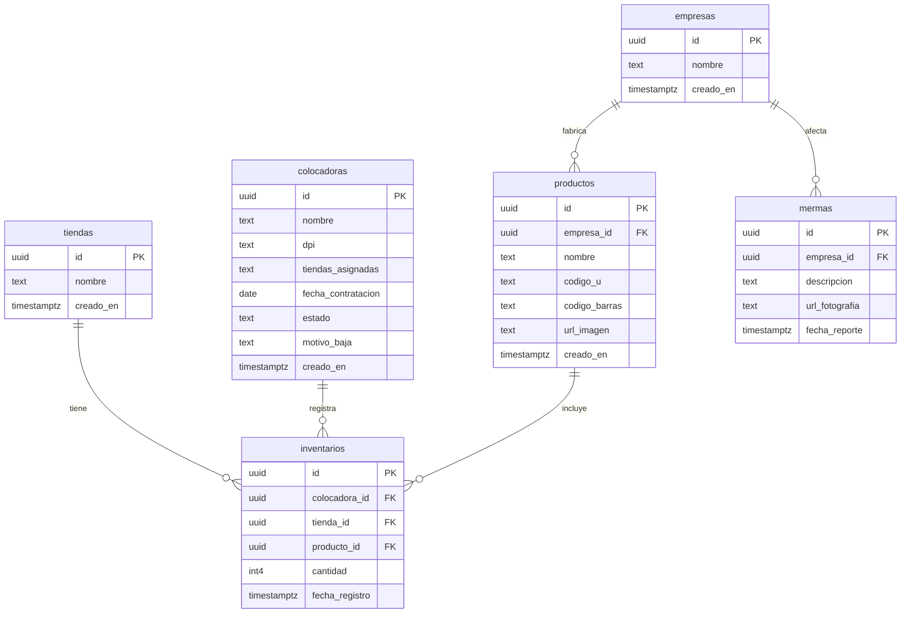

# Comercializadora Los Altos — Sistema Web de Control de Inventarios y Colocación

[](https://eduardo-fu.github.io/Comercializadora-Los-Altos/)
[](https://vercel.com/new/clone?repository-url=https%3A%2F%2Fgithub.com%2FEduardo-Fu%2FComercializadora-Los-Altos)

[](https://nextjs.org/)
[](https://react.dev/)
[](https://www.typescriptlang.org/)
[](https://tailwindcss.com/)
[](https://supabase.com/)
[](https://www.docker.com/)

Plataforma web integral diseñada para la optimización del control de inventarios físicos, supervisión de colocadoras en campo, reporte de mermas con evidencia fotográfica y generación de reportes analíticos para supermercados independientes y empresas proveedoras en Guatemala.

---

## 🌐 Cómo Ver la Aplicación en Línea (Demo Pública)

Para que cualquier persona pueda abrir y probar tu proyecto directamente desde GitHub:

### Opción 1: GitHub Pages (Directo en tu GitHub — Gratis y Permanente)

La aplicación ya cuenta con el flujo automatizado de compilación en `.github/workflows/deploy.yml`.

1. En tu repositorio en GitHub, ve a **Settings** (pestaña superior).
2. En el menú izquierdo, haz clic en **Pages**.
3. En la sección **Build and deployment** > **Source**, cambia el selector a: **`GitHub Actions`**.
   *(Si dejas "Deploy from a branch", GitHub solo servirá código TypeScript crudo sin compilar, lo cual causa la pantalla en blanco).*
4. Haz `git push` a tu rama `main`.
5. Tu sitio estará disponible públicamente y funcionando en:
   👉 **`https://eduardo-fu.github.io/Comercializadora-Los-Altos/`**

---

### Opción 2: Despliegue en Vercel (En 30 segundos)

1. Ingresa a [Vercel](https://vercel.com) e inicia sesión con tu cuenta de GitHub.
2. Haz clic en **Add New Project** e importa tu repositorio **`Eduardo-Fu/Comercializadora-Los-Altos`**.
3. Haz clic en **Deploy**. Obtendrás un enlace público permanente HTTPS (ejemplo: `https://comercializadora-los-altos.vercel.app`).

---

## 📋 Tabla de Contenidos
- [Características Principales](#-características-principales)
- [Módulos y Roles](#-módulos-y-roles)
- [Arquitectura de Base de Datos](#-arquitectura-de-base-de-datos)
- [Credenciales de Demostración](#-credenciales-de-demostración)
- [Instalación y Ejecución Local](#-instalación-y-ejecución-local)
- [Estructura del Proyecto](#-estructura-del-proyecto)
- [Licencia](#-licencia)

---

## ✨ Características Principales

- **Gestión Multi-Rol con RBAC**: Control de acceso basado en roles para Administradores, Colocadoras de campo y Empresas proveedoras de productos.
- **Toma de Inventarios Móvil**: Interfaz optimizada para teléfonos celulares en campo con validación estricta de entradas numéricas enteras (sin caracteres inválidos ni secuencias `00`).
- **Control Fotográfico de Mermas**: Registro de productos dañados con fotografía, supermercado, empresa y motivo para reclamos de garantía y créditos.
- **Alertas de Vencimiento de Lotes**: Clasificación visual automática de productos en estado *Vigente*, *Por Vencer (< 30 días)* y *Vencido*.
- **Portal de Proveedores con Aislamiento**: Cada marca (ej. Irex, Tío Nacho) visualiza únicamente sus existencias, rotación de producto (Alta, Media, Baja) y puede descargar reportes en formato CSV.
- **Base de Datos en Supabase / PostgreSQL**: Conexión opcional a Supabase con persistencia local de respaldo.

---

## 👥 Módulos y Roles

### 1. 🛡️ Módulo de Administración (`/admin`)
- **Dashboard Global**: Estadísticas de tiendas activas, marcas proveedoras, catálogo total de productos y colocadoras registradas.
- **Gestión de Colocadoras**: Contratación formal con registro de DPI numérico, fecha de ingreso, asignación de tiendas y bajas con motivo auditado.
- **Gestión de Tiendas y Supermercados**: Administración de puntos de venta (Gran Gallo, Más y Más, Espiga de Oro, La Estrella Malacatán).
- **Catálogo Maestro de Productos**: Registro de Código U interno, Código de barras (EAN), fotografía y empresa fabricante.
- **Mermas, Vencimientos y Sugeridos**: Supervisión y generación de órdenes de compra sugeridas para reposición de góndola.

### 2. 🏪 Módulo de Colocadora de Campo (`/colocadora`)
- Selector de tienda asignada por turno.
- **Toma de Inventario**: Conteo físico por góndola y pasillo.
- **Reporte de Producto en Mal Estado**: Subida de fotografía del daño y descripción detallada.
- **Registro de Vencimientos**: Fecha de caducidad por lote y cantidad encontrada.
- **Historial de Actividad**: Registro cronológico de actividades completadas.

### 3. 🏢 Módulo de Empresa Proveedora (`/empresa`)
- Aislamiento estricto de datos de acuerdo a la empresa autenticada.
- **Existencias por Tienda**: Stock consolidado por supermercado.
- **Análisis de Rotación de Inventario**: Clasificación de movimiento en góndola (Alta rotación > 30 uds, Media 15-30 uds, Baja < 15 uds).
- **Reporte de Mermas y Vencimientos**: Historial de averías y productos próximos a caducar.
- **Exportación a CSV**: Descarga directa de archivos de cálculo compatibles con Microsoft Excel y Google Sheets.

---

## 🗄️ Arquitectura de Base de Datos



---

## 🔑 Credenciales de Demostración

El sistema incluye usuarios preconfigurados listos para pruebas:

| Rol | Correo Electrónico | Contraseña | Permisos |
| :--- | :--- | :--- | :--- |
| **Administrador** | `admin@losaltos.com` | `admin123` | Acceso completo a todo el sistema y reportería global. |
| **Colocadora** | `colocadora@losaltos.com` | `colocadora123` | Toma de inventario, subida de mermas y vencimientos. |
| **Empresa (Irex)** | `irex@comercializadoralosaltos.com` | `empresa123` | Acceso analítico a métricas y productos de la marca Irex. |

---

## 🚀 Instalación y Ejecución Local

### Con Docker Compose (Recomendado)

```bash
git clone https://github.com/Eduardo-Fu/Losaltosproto.git
cd Losaltosproto
docker compose up --build
```
Abre en tu navegador: **`http://localhost:3000`**

### Con Node.js

```bash
git clone https://github.com/Eduardo-Fu/Losaltosproto.git
cd Losaltosproto
npm install
npm run dev
```
Abre en tu navegador: **`http://localhost:3000`**

---

## 📁 Estructura del Proyecto

```text
Losaltosproto/
├── .github/workflows/          # Flujo automatizado de despliegue en GitHub Pages
│   └── deploy.yml
├── docker-compose.yml          # Configuración Docker Compose desarrollo
├── docker-compose.prod.yml     # Configuración Docker Compose producción
├── Dockerfile                  # Construcción de contenedor
├── DEPLOYMENT.md               # Guía exhaustiva de despliegue en Ubuntu y SSL
├── PLAN_DE_PROYECTO.md         # Documentación de especificación funcional
├── src/
│   ├── app/                    # Rutas y páginas de la aplicación
│   ├── components/             # Componentes reutilizables (Navbar, modales)
│   ├── data/                   # Manejo de datos y almacenamiento
│   ├── lib/                    # Cliente de Supabase y utilidades
│   └── views/                  # Vistas principales de la interfaz
└── public/                     # Archivos estáticos
```

---

## 📄 Licencia

Este proyecto está desarrollado para **Comercializadora Los Altos**. Todos los derechos reservados.
